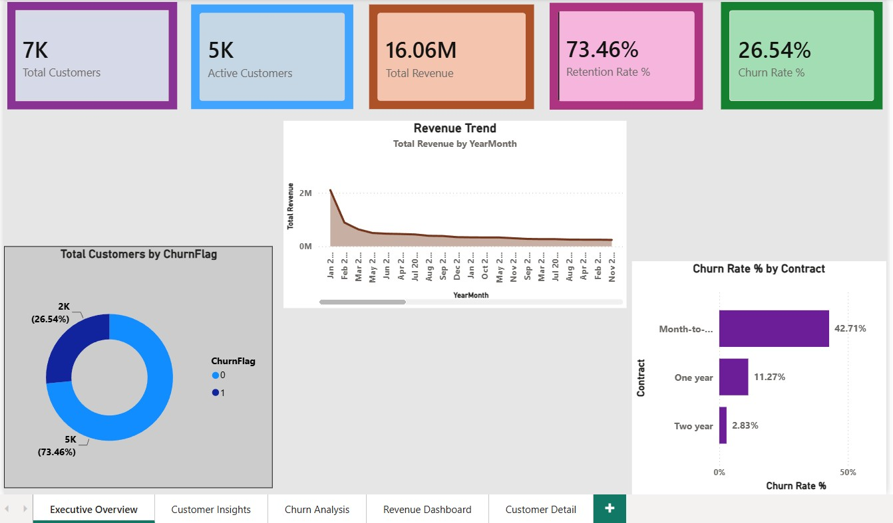
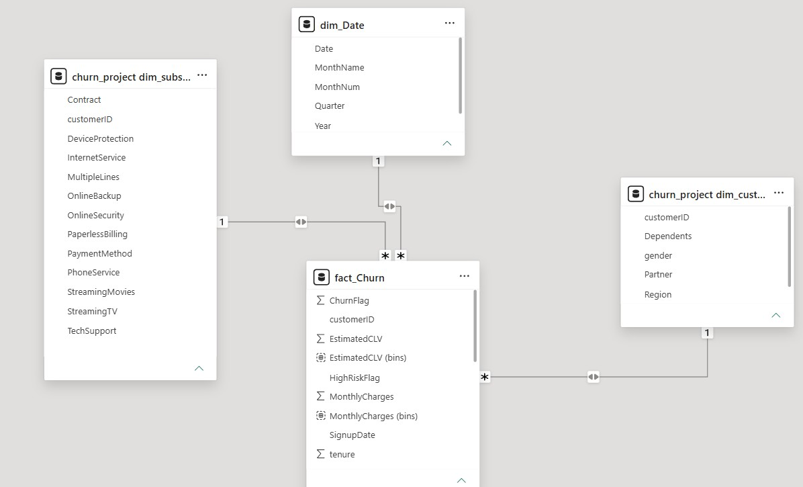
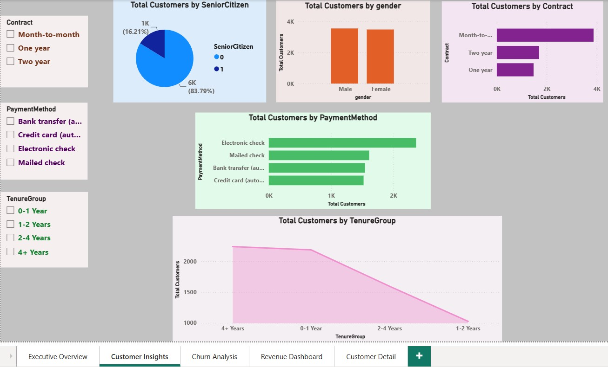
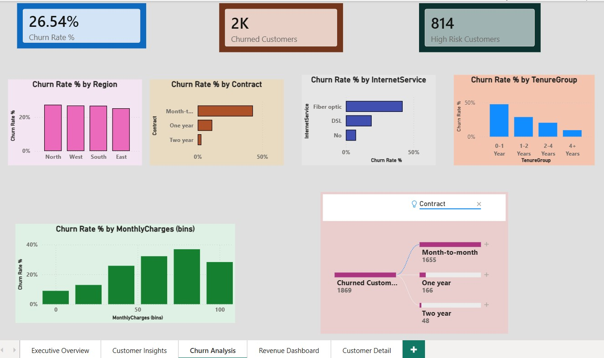
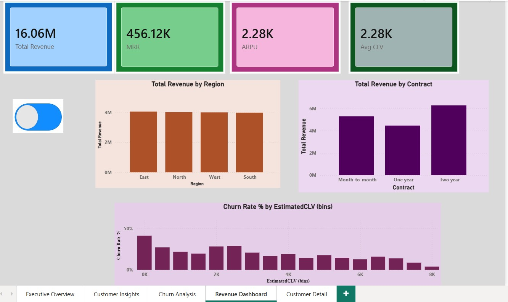

# Customer Churn & Retention Analytics Dashboard

An end-to-end analytics project that analyzes customer subscription data to identify churn drivers, segment high-risk customers, and surface revenue insights — built using **Python, MySQL, and Power BI**.



---

## 📌 Problem Statement

Customer churn directly impacts subscription-based revenue. This project analyzes a telecom customer dataset to answer:

- What % of customers are churning, and how does it trend over time?
- Which customer segments (contract type, tenure, payment method, charges) are most at risk?
- What is the revenue impact of churn, and where should retention efforts focus?

---

## 🛠️ Tech Stack

| Layer | Tool |
|---|---|
| Data Cleaning & Feature Engineering | Python (pandas, numpy) |
| Database & Star Schema | MySQL (MySQL Workbench) |
| Visualization & Reporting | Power BI Desktop |
| Query Logic | SQL (CTEs, Window Functions, Views) |

---

## 📂 Dataset

**Source:** [Telco Customer Churn Dataset (Kaggle)](https://www.kaggle.com/datasets/blastchar/telco-customer-churn)

- ~7,043 customer records
- 21 original columns: demographics, account info, services subscribed, charges, and churn label

**Note on data limitations:** The raw dataset is a single snapshot with no transaction dates or geography field. To enable time-series trend analysis and regional breakdowns, a `SignupDate` field was engineered by projecting backward from each customer's `tenure`, and a `Region` field was synthetically generated for demonstration purposes. These are clearly simulated fields, documented here for transparency — all other fields are original.

---

## 🧹 Data Cleaning & Feature Engineering (Python)

- Converted `TotalCharges` from text to numeric; handled blank values for customers with zero tenure
- Removed duplicate records
- Standardized categorical values (e.g., collapsed "No internet service" → "No" for consistent grouping)
- **Feature engineering:**
  - `TenureGroup` — bucketed tenure into 0–1yr, 1–2yr, 2–4yr, 4+yr cohorts
  - `EstimatedCLV` — Customer Lifetime Value approximation (Monthly Charges × Tenure)
  - `HighRiskFlag` — rule-based flag for customers on month-to-month contracts, low tenure, and high monthly charges
  - `SignupDate` — simulated signup date derived from tenure, to enable trend analysis
  - `Region` — synthetic region assignment for geographic analysis
- Outlier check on `MonthlyCharges` using IQR method
- Exported cleaned dataset to CSV for database ingestion

📄 Script: [`churn_data_cleaning.py`](data_clean.py)

---

## 🗄️ Database & Star Schema (MySQL)

Raw data was loaded into MySQL and modeled into a **star schema** using SQL views:

- `fact_Churn` — tenure, charges, CLV, churn flag, tenure group, risk flag, signup date
- `dim_Customer` — customer demographics
- `dim_Subscription` — contract, payment method, and subscribed services

**SQL concepts demonstrated:**
- CTEs
- Window functions — `RANK()`, `ROW_NUMBER()`, `LAG()`
- `CASE WHEN` logic for churn rate calculations
- Joins across fact and dimension views
- Aggregate functions for KPI validation queries




---

## 📊 Power BI Dashboard

A 4-page interactive report built on the star schema above, with a dedicated `dim_Date` table (created via DAX `CALENDAR()`) for time intelligence.

### 1. Executive Overview
High-level KPIs and revenue trend for a quick business snapshot — Total Customers, Churn Rate, Retention Rate, Revenue, and Monthly Revenue Trend.


### 2. Customer Insights
Demographic and behavioral breakdown of the customer base — contract type, payment method, tenure distribution, and account profile.



### 3. Churn Analysis
The core analytical page — churn rate by region, contract, tenure, and charge bracket, plus an interactive **decomposition tree** to explore churn drivers and a high-risk customer watchlist.



### 4. Revenue Dashboard
Revenue-focused view — MRR, ARPU, CLV distribution, and cumulative revenue trend, segmented by region and contract type.



**Interactive features:**
- **Drillthrough** — right-click any region/contract bar on the Churn Analysis page to jump to a filtered customer-level detail view
- **Bookmarks** — toggle buttons on the Revenue Dashboard to switch between count view and revenue view

---

## 📐 Key DAX Measures

```dax
Churn Rate % = DIVIDE([Churned Customers], [Total Customers], 0)
Retention Rate % = 1 - [Churn Rate %]
ARPU = DIVIDE([Total Revenue], [Total Customers], 0)
MRR = SUMX(fact_Churn, fact_Churn[MonthlyCharges])
Avg CLV = AVERAGE(fact_Churn[EstimatedCLV])
YoY Revenue Growth % = 
    VAR CurrentRevenue = [Total Revenue]
    VAR PriorYearRevenue = CALCULATE([Total Revenue], SAMEPERIODLASTYEAR(dim_Date[Date]))
    RETURN DIVIDE(CurrentRevenue - PriorYearRevenue, PriorYearRevenue, 0)
```


## 💡 Key Insights

- Month-to-month contract holders churn at a significantly higher rate than one- or two-year contract holders, suggesting contract length is a strong retention lever.
- Customers with tenure under 12 months combined with high monthly charges represent the highest-risk segment for churn.
- Electronic check as a payment method correlates with elevated churn compared to automatic payment methods.
- A meaningful share of at-risk revenue is concentrated in a small number of high-risk customer profiles, making targeted retention campaigns a cost-effective strategy.

---


---


